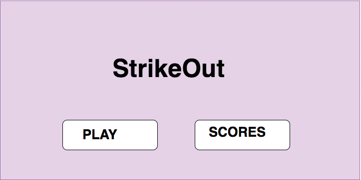
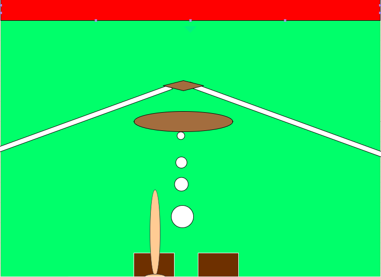
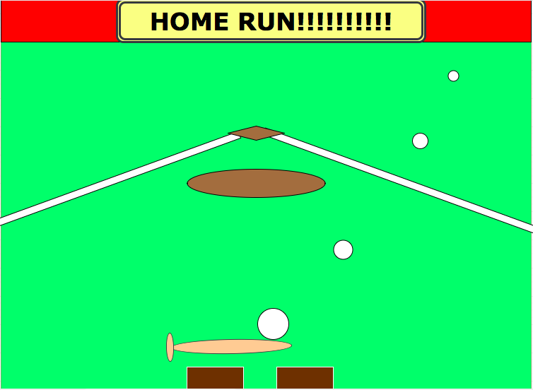
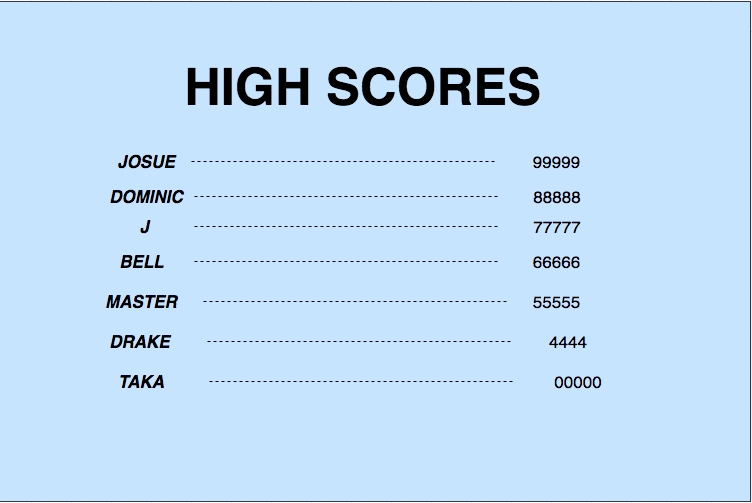

# strikeOut

*** Josue Perez / 6/10/17 *** 

# [StrikeOut] Proposal 

## What is [StrikeOut]? It will be about how many Home Runs you can hit. 

## How-to-Play

Once the page loads, click on the splash screen.
Use the spacebar to hit HOME RUNS watch your timing, to early can lead to a strike.
If you are not feeling lucky with the upcoming pitch let it pass by and just press P
when you are ready for the next one.

## Wireframe 

## Initial thoughts on game structure. 

 Having a a good contact collision for when hitting the ball.
 Make the ball travel different ways.

## Phases of Completion 

(The steps or phases you expect to go through, and the tasks that you'll need to accomplish to reach each step. These should resemble the acceptance criteria we were working through earlier.) 

## Links and Resources 

This Game was made with: HTML- CSS - JavaScript

https://www.youtube.com/watch?v=6gnb0wb9l7Q
https://www.youtube.com/watch?v=h-zwL615rb4
